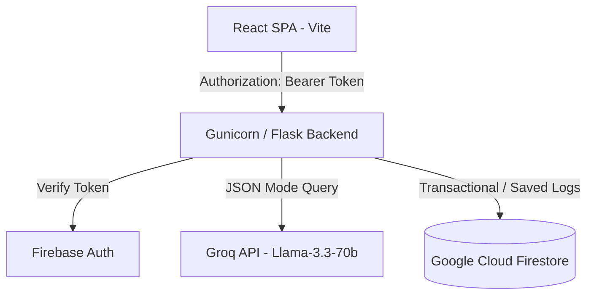

# CivicSathi AI — Comprehensive Project Report

> **Version**: 2.0  
> **Target Audience**: Stakeholders, Core Engineering Team, and Evaluators  
> **Project Directory**: [CivilSathi](file:///s:/Projects/CivilSathi)

---

## 1. Executive Summary & Vision

### 1.1 Executive Summary
CivicSathi AI is a state-of-the-art administrative assistance platform designed to bridge the complex, fragmented gap between Indian citizens and government services. Operating as a unified portal, it translates dense legal rules, department jurisdictions, and application procedures into simplified, actionable guides. 

By integrating low-latency Large Language Model (LLM) reasoning via Groq with a robust React UI, CivicSathi AI empowers users to search for schemes, prepare error-free document checklists, simplify bureaucratic notifications, and draft localized municipal complaints in seconds.

### 1.2 The Civic Problem
* **Information Asymmetry**: Crucial service guidelines and benefit conditions are scattered across thousands of disconnected central, state, and local portals.
* **Complex Language**: Official circulars, notifications, and application guidelines are written in dense, intimidating legal and administrative jargon.
* **Opaque Categorization**: Citizens struggling with municipal issues (e.g., public works, sewage, sanitation) rarely know which specific government department or local ward officer holds jurisdiction over their grievance.
* **Lack of Personalization**: Existing portals require users to scan generic pages rather than matching benefits directly to their demographic profile.

---

## 2. Core Features & Capabilities

CivicSathi AI provides six central citizen-centric features:

| # | Feature | Target Action | Implementation Details |
|---|---|---|---|
| **1** | **AI Civic Assistant** | General Administrative Queries | Custom LLM context query parsing that outputs structured step-by-step guides, required documents, estimated processing times, links to official portals, and an explicit AI confidence rating. |
| **2** | **Scheme Eligibility Finder** | Personalized Benefit Matching | Accepts user demographics (age, state, category, income, occupation) and returns a list of matching central and state schemes sorted by eligibility matching scores. |
| **3** | **Doc Checklist Generator** | Application Prep Checklist | Generates a localized list of required and optional documents for common services (e.g., Passport, PAN, Driving License) along with verification tips to prevent rejections. |
| **4** | **Notification Simplifier** | Circular/PDF Translation | Translates pasted bureaucratic circulars into summary bullets, critical deadlines, and action items. |
| **5** | **Civic Complaint Generator** | Grievance Drafting | Classifies local civic grievances from photos or descriptions, maps them to the correct local ward/department, assigns priority, and drafts formal templates. |
| **6** | **CivicPath AI Roadmap** | Dynamic Timelines | Creates interactive roadmaps for complex administrative workflows, complete with state-by-state timelines and target deadlines. |

---

## 3. Technology Stack & System Architecture

CivicSathi AI uses a decoupled, lightweight service architecture:



### 3.1 Backend Service Layer (Python / Flask)
* **Framework**: Flask server running on Gunicorn.
* **AI Engine**: Groq SDK consuming `llama-3.3-70b-versatile` inside a strict JSON validation parser.
* **Schema Validation**: Custom parsing layers verify that Groq's JSON outputs exactly match Pydantic schemas.
* **Database**: Google Cloud Firestore utilizing transactional increments for user token limits.
* **Auth Verification**: Firebase Admin SDK verifying Bearer JWTs on protected endpoints.

### 3.2 Frontend Client Layer (React / Vite)
* **Build System**: Vite (React 18).
* **Styling**: Vanilla Tailwind CSS styled according to Google Stitch design systems.
* **Routing**: React Router DOM (v6) with Protected Route gates.
* **State Management**: React Context APIs (`AuthContext`, `LanguageContext`) managing sessions and visual preferences.

---

## 4. Software Architecture & File Layout

The codebase is organized as follows:

```
CivilSathi/
├── backend/                     # Python Flask API
│   ├── app.py                   # App initializer & Blueprint routers
│   ├── config.py                # Environment configuration settings
│   ├── models/
│   │   └── schemas.py           # Pydantic schemas for LLM JSON enforcement
│   ├── routes/                  # API Controllers (thin endpoints)
│   │   ├── auth.py, chat.py, checklist.py, complaint.py, 
│   │   ├── dashboard.py, schemes.py, simplify.py
│   ├── services/                # Business logic (Groq / Firestore services)
│   │   ├── chat_service.py, checklist_service.py, complaint_service.py,
│   │   ├── firebase_service.py, groq_service.py, schemes_service.py,
│   │   ├── simplify_service.py, prompts.py
│   └── utils/
│       ├── auth_middleware.py   # JWT verifier & dev-mode auth bypass
│       ├── responses.py         # Standard response wrappers
│       └── rate_limit.py        # Token usage trackers
└── frontend/                    # React SPA Client
    ├── index.html               # Configures Stitch font styles & relative scaling
    ├── src/
    │   ├── App.jsx              # Routing & global providers boundaries
    │   ├── main.jsx             # React entry point
    │   ├── components/          # Reusable components
    │   │   ├── Layout.jsx       # App sidebar & wrapper grid
    │   │   ├── SettingsModal.jsx # Visual preferences manager overlay
    │   │   └── ProtectedRoute.jsx
    │   ├── context/
    │   │   ├── AuthContext.jsx  # Firebase session & dev bypass logins
    │   │   └── LanguageContext.jsx # Localized dictionary & preferences
    │   ├── pages/               # Page containers for core features
    │   │   ├── Dashboard.jsx, Checklist.jsx, Profile.jsx, ProfileSetup.jsx ...
    │   └── lib/
    │       ├── apiClient.js     # Global fetch interceptors
    │       └── endpoints.js     # API route mappings
```

---

## 5. Developer Enhancements & Custom Extensions

During the recent development cycle, several critical enhancements were implemented:

### 5.1 Stacking Context & Contrast Resolution
> [!NOTE]
> Resolves a major frontend contrast bug on the checklist generator canvas card.

* **Issue**: The checklist results cards previously overlayed a dark blue-orange background gradient that completely obscured the dark text (`#151c27`). This occurred because the card used `backdrop-blur-md` (`backdrop-filter`), creating a new stacking context. The gradient border's `::before` pseudo-element had a negative `z-index`, forcing it to stack *above* the card's background.
* **Fix**: Separated the gradient border and content backgrounds into a nested layout in [Checklist.jsx](file:///s:/Projects/CivilSathi/frontend/src/pages/Checklist.jsx#L110-L142). The outer div handles the gradient padding, and the inner container applies the translucent background and text content.

### 5.2 Local Development Auth Bypass
* **Mechanism**: To allow testing without active Firebase Google Sign-In windows or network dependencies, a mock token bypass was built.
* **Backend**: Enabling `AUTH_DISABLED=true` in `backend/.env` intercepts request authorization headers and seeds a mock user profile on Flask's global context.
* **Frontend**: [Login.jsx](file:///s:/Projects/CivilSathi/frontend/src/pages/Login.jsx) exposes a "Developer Bypass" button during local runs. This invokes a mock session in [AuthContext.jsx](file:///s:/Projects/CivilSathi/frontend/src/context/AuthContext.jsx) that provides a mock token (`mock-dev-token`) accepted by the backend.

### 5.3 Global Visual & Convenience Preferences
We added a global preference system that controls:
1. **Language Selection**: Full app toggle between English and Hindi, loading localized translation keys reactively.
2. **Visual Theme**: Theme toggling between Light and Dark mode, synchronizing class list selectors on the root `<html>` element.
3. **Text Size Scaling**: Dynamic text sizing (Small, Normal, Large, and Extra Large). This updates the root document `fontSize` (from `14px` up to `20px`). Because the Tailwind Stitch rules were converted to relative `rem` units in `index.html`, this scales the entire user interface proportionally.
4. **Onboarding Integration**: Added these settings as **Step 1: Convenience Preferences** in the onboarding wizard ([ProfileSetup.jsx](file:///s:/Projects/CivilSathi/frontend/src/pages/ProfileSetup.jsx)), moving subsequent setup steps to a 6-step wizard.
5. **Settings Panel**: Built a global [SettingsModal.jsx](file:///s:/Projects/CivilSathi/frontend/src/components/SettingsModal.jsx) overlay that can be opened instantly from the Dashboard or Profile page headers.

---

## 6. Database Models & Schema Shapes

All application collections are stored in Google Cloud Firestore:

### 6.1 User Profile Document
* **Path**: `/users/{uid}`
```json
{
  "uid": "dev-user",
  "email": "dev@civicsathi.local",
  "name": "Development User",
  "phone": "+919876543210",
  "dob": "1995-06-15",
  "gender": "Male",
  "state": "Maharashtra",
  "district": "Pune",
  "city": "Shivajinagar",
  "pincode": "411005",
  "education": "Graduate",
  "occupation": "Self-employed",
  "annualIncome": "₹5–10 Lakh",
  "category": "General",
  "disability": "No",
  "interests": ["Government Schemes", "Education"],
  "profileCompletion": 100,
  "updatedAt": "2026-07-12T00:00:00Z"
}
```

### 6.2 AI Civic Query Logs
* **Path**: `/chats/{chatId}`
```json
{
  "userId": "dev-user",
  "title": "Applying for Passport",
  "messages": [
    {
      "sender": "user",
      "text": "How do I get a passport?",
      "timestamp": "2026-07-12T00:05:00Z"
    },
    {
      "sender": "ai",
      "text": "Applying for an Indian Passport requires online registration...",
      "timestamp": "2026-07-12T00:05:02Z",
      "metadata": {
        "steps": ["Register on portal", "Pay fee", "Schedule PSK slot"],
        "docs": ["Aadhaar", "Birth Certificate"],
        "time": "15 Days",
        "portalUrl": "https://passportindia.gov.in",
        "confidence": 98
      }
    }
  ]
}
```

---

## 7. Installation, Setup & Verification

### 7.1 Setup Requirements
1. **Python**: Version `3.9+`
2. **Node.js**: Version `18+`
3. **Environment Keys**: A valid Groq API key is required in `backend/.env`.

### 7.2 Running Backend
```powershell
cd backend
python -m venv venv
# Activate virtual environment
.\venv\Scripts\activate
pip install -r requirements.txt
python app.py
```
* Serves locally on: `http://127.0.0.1:5000`

### 7.3 Running Frontend
```powershell
cd frontend
npm install
npm run dev
```
* Serves locally on: `http://localhost:5173/`

### 7.4 Verification Checklist
* **Syntax Compilation**: Ensure clean compilation of both frontend and backend modules:
  * Backend: `python -m compileall backend`
  * Frontend: `npm run build`
* **Local Auth Bypass**: Open the login screen and click **Developer Bypass (Mock Sign In)** to verify the bypass authentication pipeline.
